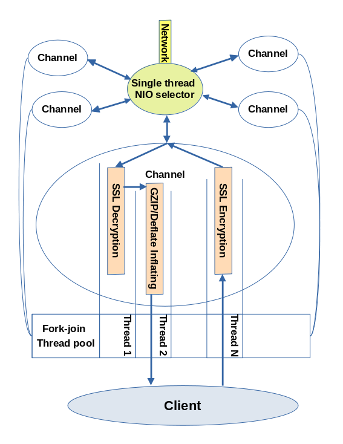

## The '__netgym__' network client for java apps

'netgym' is a compact high performance asynchronous network client for using various socket-based (TCP and UDP) connections.
Among TCP features it supports secure socket connections (TLS), HTTP/1.1, including:

1. Rest methods GET, POST (with arbitrary content, url-encoded, form-data), PUT, DELETE, OPTIONS;
1. HTTP/1.1 connections: Single/Closable (per request), Keep-alive and Pipelining;
1. HTTPS (TLS) connections.

The crucial idea of this library is that the only one instance of client is used to serve all socket-based connections and is built on
limited thread pool. Furthermore, different stages or operations of one connection can perform in parallel on the same
 fork-join thread pool.



As it is shown above, the following operations execute in parallel increasing performance:

1. TLS handshake in particular Thread Pool used for blocking operations
1. Data encryption/decryption within a TLS connection
1. Gzip/deflate data compressing/uncompressing

## Requirements

Runtime builds of "netgym" library don't depend on other packages and require only JDK 1.7 or latter versions. Assembling
of this package depends on JUnit 4 and Mockito testing frameworks.

## Adding netgym to project

If you use Maven then insert the following

```xml

<dependency>
    <groupId>com.github.braginxv</groupId>
    <artifactId>netgym</artifactId>
    <version>0.7</version>
</dependency>
```

In case of using Gradle

```groovy
implementation 'com.github.braginxv:netgym:0.7'
```

To add to a scala project use the following

```scala
libraryDependencies += "com.github.braginxv" % "netgym" % "0.7"
```

## Typical usage

### Asynchronous requests

Suppose we need to download images listed in `images` variable from a remote server. These images can be downloaded 
asynchronously to prevent blocking userspace thread (such as UI thread).

```java
  final SimpleHttpClient requestBuilder = new SimpleHttpClient(baseUrl)
    .configureConnection(SimpleHttpClient.ConnectionType.Single)
    .addHeader("User-Agent", "Netgym network library (https://github.com/braginxv/netgym)");

  // TODO: for modeling synchronous flow in console app, remove the latch in production app
  final CountDownLatch latch = new CountDownLatch(urls.length);
  
  final Pattern fileNamePattern = Pattern.compile(".*/(?=[^/]+$)");
  
  Arrays.stream(urls)
    .forEachOrdered(url -> requestBuilder.asyncRawGET(url, serverResponse -> {
        serverResponse.left().apply(System.err::println);
        
        serverResponse.right().apply( response -> {
           if (response.getCode() != HttpURLConnection.HTTP_OK) {
              System.err.printf("Downloading failed with HTTP code: %d\n", response.getCode());
              return;
           }
           try {
               Files.write(Paths.get(imageDirectory, fileNamePattern.matcher(url).replaceFirst("")), response.getContent());
            } catch (IOException e) {
               e.printStackTrace();
            } finally { latch.countDown(); }
        });
     }));

  // TODO: await all asynchronous requests to be done, remove the latch in production app
  latch.await();

  // shutdown Network Client before the application terminates
  ClientSystem.client().shutdown();
  ClientSystem.client().awaitTerminating();   
```

### Synchronous flow

Sometimes thread could be blocked until a response is received. In these cases you'd use synchronous
adapters like this:

```java

   final SimpleHttpClient requestBuilder = new SimpleHttpClient(baseUrl)
        .configureConnection(SimpleHttpClient.ConnectionType.Single)
        .addHeader("User-Agent", "Netgym network library (https://github.com/braginxv/netgym)");

   final Pattern fileNamePattern = Pattern.compile(".*/(?=[^/]+$)");
   
   Arrays.stream(urls)
    .map(url -> new Pair<>(url, requestBuilder.syncRawGET(url)))
    .map(completion -> {
           try {
               return new Pair<>(completion.getKey(), completion.getValue().awaitResult());
           } catch (InterruptedException e) {
               System.err.printf("image \"%s\" wasn't loaded\n", completion.getValue());
               return null;
           }
        })
   .filter(Objects::nonNull)
   .forEach(image -> {
      Either<String, Response> serverResponse = image.getValue();
      serverResponse.left().apply(System.err::println);
      serverResponse.right().apply(response ->
         {
           if (response.getCode() != HttpURLConnection.HTTP_OK) {
              System.err.printf("Downloading failed with HTTP code: %d\n", response.getCode());
              return;
           }
            try {
               Files.write(Paths.get(imageDirectory,
               fileNamePattern.matcher(image.getKey()).replaceFirst("")), response.getContent());
            } catch (IOException e) {
                e.printStackTrace();
            }
         });
   });
   
   // shutdown Network Client before application is terminated
   ClientSystem.client().shutdown();
   ClientSystem.client().awaitTerminating();
```

### RxJava example

```java

  final SimpleHttpClient requestBuilder = new SimpleHttpClient(baseUrl)
     .configureConnection(SimpleHttpClient.ConnectionType.Single)
     .addHeader("User-Agent", "Netgym network library (https://github.com/braginxv/netgym)");
   
  final Pattern fileNamePattern = Pattern.compile(".*/(?=[^/]+$)");
  
  Observable<Pair<String, byte[]>> imageSource = Observable
     .fromIterable(Arrays.asList(urls))
     .flatMap((Function<String, ObservableSource<Pair<String, Response>>>) path ->
        Observable.create((ObservableOnSubscribe<Pair<String, Response>>) emitter ->
           requestBuilder.asyncRawGET(path, result -> {
            result.left().apply(message -> emitter.onError(new RuntimeException(message)));
      
            result.right().apply(response -> {
                 emitter.onNext(new Pair<>(path, response));
                 emitter.onComplete();
            });
     })))
     .filter(imageData -> imageData.getValue().getCode() == HttpURLConnection.HTTP_OK)
     .map(imageData -> new Pair<>(fileNamePattern.matcher(imageData.getKey()).replaceFirst(""),
        imageData.getValue().getContent()));

  imageSource.blockingSubscribe(image -> Files.write(Paths.get(imageDirectory, image.getKey()), image.getValue()));

  // shutdown Network Client before application is terminated
  ClientSystem.client().shutdown();
  ClientSystem.client().awaitTerminating();
```
Note that there is no need to engage auxiliary threads through `subscribeOn()` cuz `netgym` client optimally
parallels network connections itself and performs requests asynchronously.

## HTTP connection types

The client supports following connections (HTTP/1.1)

1. `httpRequestBuilder.configureConnection(HttpRequestBuilder.ConnectionType.Single)`
   It's a closable TCP connection being disconnected after having obtained a response. Due to the fact that these
   connections are executed in parallel and not depend on each other, this type of connection can be fastest to perform
   parallel requests.
2. `httpRequestBuilder.configureConnection(HttpRequestBuilder.ConnectionType.Persistent)`
   In this case it is allowed to send multiple requests through the same TCP and TLS sessions. 
   These connections are also called "keep-alive".
3. `httpRequestBuilder.configureConnection(HttpRequestBuilder.ConnectionType.Pipelining)`
   Similar to Persistent connections the Pipelining connection is used to sending multiple requests, but it isn't
   waiting the response from previous request to send a new one, hence this connection is faster than the persistent
   connection. In spite of Pipelining connections are the part of standard HTTP/1.1 they may not be supported or
   may be supported partially by many servers.
4. `httpRequestBuilder.configurePipeliningConnection(TIME_DELAY_BETWEEN_REQUEST_SENDING)`
   Sometimes a remote server cannot process multiple requests sent all at once in Pipelining connection, but it could be done in this way if
   requests were sent with a little delay. Invoke this method to use Pipelining connection and specify delay in ms between
   requests being sent.
